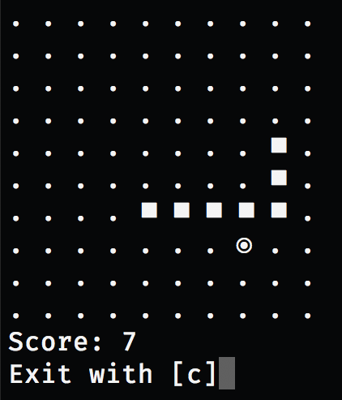

# Snake

Reusable logic for the classic game `Snake`, implemented with the `reducer` pattern. This library exposes a `reducer` function with the signature `(state, action) -> state`, `actions` for advancing the game one tick (`actions.advance`), controlling the snake (`actions.goUp`, `actions.goDown`, `actions.goLeft`, `actions.goRight`) and restarting (`actions.restart`) and an `initialState` Object. All actions are synchronous (ie. return an object like `{type: "ADVANCE"}`) and none take any arguments.



The type of the game state looks like this:

```typescript
type State = {
  // Grid dimensions
  width: number;
  height: number;
  // Snake's head position
  x: number;
  y: number;
  direction: 'left' | 'right' | 'up' | 'down';
  // Game status
  status: 'running' | 'over';
  score: number;
  tail: Array<{ x: number; y: number }>;
  items: Array<{ x: number; y: number }>;
};
```

Check out the examples for detailed usage paterns.
